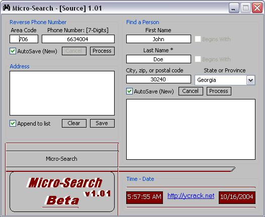



## MicroSearch \(Advanced telephone reversal tool\) And New Beta Lookup Phone by Name and Area \(GET NOW\!\)

### Description

This lets you take any phone number (if available: if its not private by customer request to their phone company) and reverse it to get their Name, Address, City, State, and Zip Code! There's not a program out there like this, and I don't want anyone copying it. It's mainly a good example to learn how to parse data, and a good way for me to share my program! I hope you enjoy it as much as I did making it!
 
### More Info
 

             |
---                |---
**Submitted On**   |2004-10-16 05:58:18
**By**             |[Brian D\. Matthews](https://github.com/Planet-Source-Code/PSCIndex/blob/master/ByAuthor/brian-d-matthews.md)
**Level**          |Intermediate
**User Rating**    |5.0 (10 globes from 2 users)
**Compatibility**  |VB 6\.0
**Category**       |[Miscellaneous](https://github.com/Planet-Source-Code/PSCIndex/blob/master/ByCategory/miscellaneous__1-1.md)
**World**          |[Visual Basic](https://github.com/Planet-Source-Code/PSCIndex/blob/master/ByWorld/visual-basic.md)
**Archive File**   |[MicroSearc18062010162004\.zip](https://github.com/Planet-Source-Code/brian-d-matthews-microsearch-advanced-telephone-reversal-tool-and-new-beta-lookup-phone-by__1-56763/archive/master.zip)

